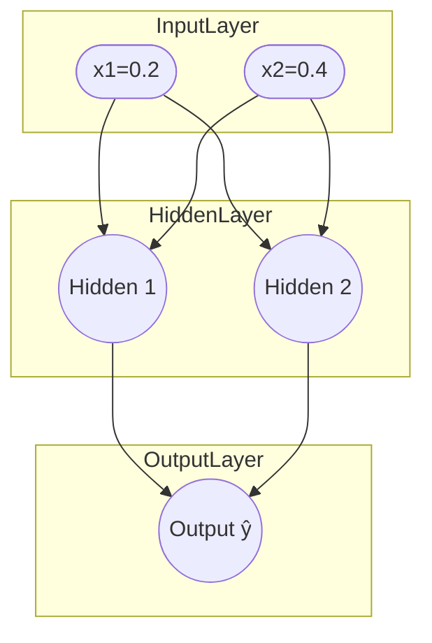

### Giới thiệu về thuật toán Backpropagation

[Thuật toán Backpropagation](https://nguyentruonglong.net/giai-thich-chi-tiet-thuat-toan-backpropagation.html) là một phương pháp lan truyền ngược (reverse-mode autodiff) được áp dụng trong [mạng nơ-ron nhân tạo](https://nguyentruonglong.net/ly-thuyet-ve-mang-no-ron-nhan-tao-artificial-neural-network-ann.html), giúp tính toán các đạo hàm cần thiết để tối ưu hóa các tham số trong mô hình.

Ý tưởng đầu tiên về [thuật toán Backpropagation](https://nguyentruonglong.net/giai-thich-chi-tiet-thuat-toan-backpropagation.html) được đề xuất bởi Paul Werbos vào năm 1974 trong bài "Beyond Regression: New Tools for Prediction and Analysis in the Behavioral Sciences". Sau đó, David Rumelhart, Geoffrey Hinton và Ronald Williams phổ biến rộng rãi thông qua bài "Learning representations by back-propagating errors" (1986), biến backprop thành phương pháp trung tâm để huấn luyện [mạng nơ-ron nhân tạo](https://nguyentruonglong.net/ly-thuyet-ve-mang-no-ron-nhan-tao-artificial-neural-network-ann.html).

Kể từ đó, backprop được sử dụng rộng rãi trong machine learning và deep learning. Dù vậy, mô hình có thể gặp hiện tượng **vanishing/exploding gradient**, khiến huấn luyện khó khăn. Vì thế có nhiều cải tiến/biến thể và kỹ thuật hỗ trợ:

 - *Weight Decay (L2 regularization)*: thêm hạng phạt vào hàm chi phí để giảm độ lớn trọng số, giúp giảm overfitting.
 - *Batch Normalization*: chuẩn hoá kích hoạt theo mini-batch, giúp huấn luyện nhanh và ổn định hơn.
 - *Adaptive Moment Estimation (Adam)*: kết hợp momentum và adaptive learning rate để thích nghi theo từng tham số.
 - *Stochastic Gradient Descent with Momentum*: thêm quán tính để giảm dao động, cải thiện hội tụ.
 - *Nesterov Accelerated Gradient*: nhìn “trước” theo hướng momentum để tinh chỉnh bước cập nhật, hội tụ tốt hơn.

---

### Ý tưởng của thuật toán Backpropagation

Backprop được dùng để tính đạo hàm của hàm mất mát theo các tham số khi áp dụng [gradient descent](https://nguyentruonglong.net/thuat-toan-gradient-descent.html). Số lượng tham số có thể rất lớn, nếu áp dụng trực tiếp quy tắc đạo hàm sẽ không hiệu quả. Backprop dùng **quy tắc chuỗi** để lan truyền gradient từ đầu ra về đầu vào qua từng lớp, nhờ đó tính gradient **hiệu quả** cho tất cả trọng số/bias.

Quy tắc chuỗi cho hàm hợp:


$$
f(x)=g(h(x)) \quad\Rightarrow\quad \frac{df}{dx}=\frac{dg}{dh}\cdot\frac{dh}{dx}.
$$


Trong mạng nơ-ron, toàn bộ mô hình là một hàm hợp nhiều lớp. Áp dụng quy tắc chuỗi lặp đi lặp lại từ lớp cuối về lớp đầu, ta thu được gradient cho mọi tham số.

---

### Quy trình 2 pha của Backpropagation

 - **Pha feedforward (lan truyền tiến)**: tính đầu ra của từng lớp để nhận dự đoán và giá trị mất mát.
 - **Pha backpropagation (lan truyền ngược)**: dùng quy tắc chuỗi để tính gradient của mất mát theo từng tham số, từ lớp cuối cùng ngược về lớp đầu.

---

### Hàm mất mát và hàm chi phí

Với một mẫu, dùng **mất mát bình phương**:


$$
L(y,\hat{y})=\frac{1}{2}\,(y-\hat{y})^2.
$$


Với tập huấn luyện kích thước $m$, **hàm chi phí** (dùng trung bình mini-batch hay toàn bộ):


$$
J(W,b)=\frac{1}{m}\sum_{i=1}^{m} L\!\left(y^{(i)},\hat{y}^{(i)}\right).
$$


---

### Kiến trúc ví dụ và ký hiệu

- **Đầu vào**: $\mathbf{x}=[x_1,x_2]^\top=(0.2,\,0.4)^\top$.
- **Lớp ẩn** (2 nơ-ron, sigmoid):  
  $\mathbf{z}^{[1]}=W^{[1]}\mathbf{x}+ \mathbf{b}^{[1]}$,  
  $\mathbf{a}^{[1]}=\sigma\!\bigl(\mathbf{z}^{[1]}\bigr)$.
- **Lớp ra** (1 nơ-ron, sigmoid):  
  $z^{[2]}=W^{[2]}\mathbf{a}^{[1]}+b^{[2]},\quad \hat{y}=a^{[2]}=\sigma\!\bigl(z^{[2]}\bigr)$.
- **Hàm kích hoạt** sigmoid: $\sigma(z)=\frac{1}{1+e^{-z}},\quad \sigma'(z)=\sigma(z)\,(1-\sigma(z))$.

Trọng số/bias:


\[
W^{[1]}=
\begin{bmatrix}
0.10 & -0.20\\
0.30 & 0.25
\end{bmatrix},\quad
\mathbf{b}^{[1]}=
\begin{bmatrix}
0.01\\
-0.02
\end{bmatrix},\quad
W^{[2]}=
\begin{bmatrix}
0.80 & 0.90
\end{bmatrix},\quad
b^{[2]}=0.10.
\]


Mục tiêu: $y=1.0$.

#### Minh họa kiến trúc mạng cho ví dụ

---

### Bước 1: Pha Feedforward


$$
\begin{aligned}
z^{[1]}_1 &= 0.10\cdot 0.2 + (-0.20)\cdot 0.4 + 0.01 = -0.05,\\
z^{[1]}_2 &= 0.30\cdot 0.2 + \phantom{(-)}0.25\cdot 0.4 - 0.02 = 0.14,\\[2pt]
a^{[1]}_1 &= \sigma(-0.05)=0.487503,\\
a^{[1]}_2 &= \sigma(0.14)=0.534943.
\end{aligned}
$$


Lớp ra:


$$
\begin{aligned}
z^{[2]} &= 0.80\cdot 0.487503 + 0.90\cdot 0.534943 + 0.10 = 0.971451,\\
\hat{y}=a^{[2]} &= \sigma(0.971451)=0.725409.
\end{aligned}
$$


Mất mát:


$$
L=\frac{1}{2}(1.0-0.725409)^2=0.037700.
$$


---

### Bước 2: Tính độ lỗi tại lớp ra


$$
\delta^{[2]}=(\hat{y}-y)\,\hat{y}(1-\hat{y})
=(0.725409-1.0)\times 0.725409\times 0.274591
=-0.054696.
$$


---

### Bước 3: Gradient tại lớp ra


$$
\frac{\partial L}{\partial W^{[2]}}=\delta^{[2]}\,\bigl(\mathbf{a}^{[1]}\bigr)^\top,\qquad
\frac{\partial L}{\partial b^{[2]}}=\delta^{[2]}.
$$


Kết quả:


$$
\frac{\partial L}{\partial W^{[2]}}
=\begin{bmatrix}
-0.026665 &\ -0.029259
\end{bmatrix},\qquad
\frac{\partial L}{\partial b^{[2]}}=-0.054696.
$$


---

### Bước 4: Lan truyền ngược về lớp ẩn


$$
\delta^{[1]}_j=\bigl(W^{[2]}_j\,\delta^{[2]}\bigr)\; a^{[1]}_j(1-a^{[1]}_j).
$$


Kết quả:


$$
\delta^{[1]}_1=-0.010932,\qquad
\delta^{[1]}_2=-0.012247.
$$


---

### Bước 5: Gradient tại lớp ẩn


$$
\frac{\partial L}{\partial W^{[1]}}=\boldsymbol{\delta}^{[1]}\, \mathbf{x}^\top,\qquad
\frac{\partial L}{\partial \mathbf{b}^{[1]}}=\boldsymbol{\delta}^{[1]}.
$$


Kết quả:


$$
\frac{\partial L}{\partial W^{[1]}}=
\begin{bmatrix}
-0.002186 & -0.004373\\
-0.002449 & -0.004899
\end{bmatrix},\qquad
\frac{\partial L}{\partial \mathbf{b}^{[1]}}=
\begin{bmatrix}
-0.010932\\
-0.012247
\end{bmatrix}.
$$


---

### Bước 6–9: Đạo hàm theo từng trọng số

- $\frac{\partial L}{\partial w_3}=\delta^{[1]}_1\,x_1=-0.002186$
- $\frac{\partial L}{\partial w_4}=\delta^{[1]}_1\,x_2=-0.004373$
- $\frac{\partial L}{\partial w_5}=\delta^{[1]}_2\,x_1=-0.002449$
- $\frac{\partial L}{\partial w_6}=\delta^{[1]}_2\,x_2=-0.004899$

---

### Bước 10: Cập nhật tham số

Với $\alpha=0.1$:

- Lớp ra:


$$
W^{[2]} \leftarrow 
\begin{bmatrix}
0.802666 & 0.902926
\end{bmatrix},\qquad
b^{[2]}\leftarrow 0.105470.
$$


- Lớp ẩn:


$$
W^{[1]}=
\begin{bmatrix}
0.100219 & -0.199563\\
0.300245 & \phantom{-}0.250490
\end{bmatrix},\qquad
\mathbf{b}^{[1]}=
\begin{bmatrix}
0.011093\\
-0.018775
\end{bmatrix}.
$$


---

### Công thức tổng quát (vector hoá)


$$
\mathbf{Z}^{[l]} = W^{[l]}\mathbf{A}^{[l-1]}+\mathbf{b}^{[l]},\quad
\mathbf{A}^{[l]}=g^{[l]}\!\bigl(\mathbf{Z}^{[l]}\bigr).
$$

$$
\boldsymbol{\delta}^{[L]}=\frac{\partial J}{\partial \mathbf{A}^{[L]}}\odot g'^{[L]}\!\bigl(\mathbf{Z}^{[L]}\bigr),\qquad
\boldsymbol{\delta}^{[l]}=\bigl(W^{[l+1]}\bigr)^\top \boldsymbol{\delta}^{[l+1]}\odot g'^{[l]}\!\bigl(\mathbf{Z}^{[l]}\bigr).
$$

$$
\frac{\partial J}{\partial W^{[l]}}=\frac{1}{m}\,\boldsymbol{\delta}^{[l]}\,\bigl(\mathbf{A}^{[l-1]}\bigr)^\top,\qquad
\frac{\partial J}{\partial \mathbf{b}^{[l]}}=\frac{1}{m}\,\sum_{i=1}^{m}\boldsymbol{\delta}^{[l](i)}.
$$


---

### Ghi chú áp dụng thực tế

- Khởi tạo: Kỹ thuật Xavier/He giúp giảm vanishing/exploding gradient.  
- Chuẩn hoá: Phương pháp BatchNorm tăng ổn định và tốc độ hội tụ.  
- Tối ưu: Các biến thể SGD+Momentum, Nesterov, Adam thường được dùng.  
- Ổn định: Có thể áp dụng Gradient clipping, chuẩn hoá dữ liệu, chọn batch size hợp lý.

---

### Tài liệu tham khảo

- Paul Werbos (1974) — *Beyond Regression: New Tools for Prediction and Analysis in the Behavioral Sciences*.  
- Rumelhart, Hinton, Williams (1986) — *Learning representations by back-propagating errors*.  
